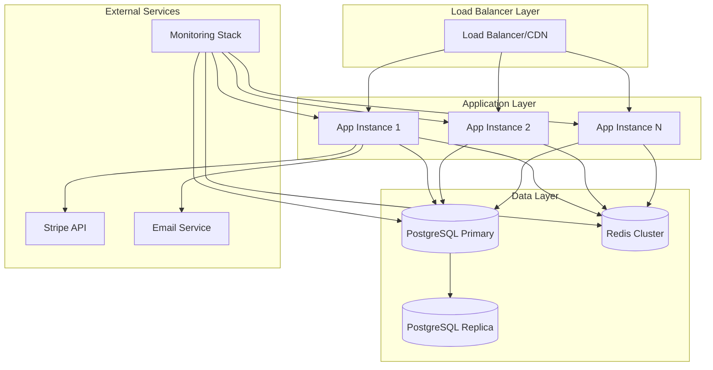
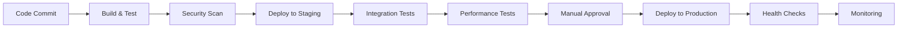

# Design Document

## Overview

The Salon Success Manager productionization design transforms a development prototype into an enterprise-grade SaaS platform. The design addresses critical production requirements including security hardening, performance optimization, scalability improvements, comprehensive testing, monitoring, and operational excellence. The solution maintains the existing React/Express/PostgreSQL architecture while implementing production-ready patterns and infrastructure.

## Architecture

### Current State Analysis

The application currently uses:
- **Frontend**: React 18 with TypeScript, Wouter routing, TanStack Query, Shadcn/ui components
- **Backend**: Express.js with TypeScript, session-based authentication, Drizzle ORM
- **Database**: PostgreSQL (Neon serverless in development)
- **Payment**: Stripe integration with 14-day trial system
- **Email**: Multiple providers (SendGrid, Gmail SMTP, Ionos SMTP)
- **Deployment**: Replit platform with basic Docker configuration

### Target Production Architecture



## Components and Interfaces

### 1. Security Hardening Layer

#### Authentication & Authorization Service
```typescript
interface AuthService {
  authenticateUser(credentials: LoginCredentials): Promise<AuthResult>
  validateSession(sessionId: string): Promise<SessionValidation>
  refreshToken(refreshToken: string): Promise<TokenPair>
  revokeSession(sessionId: string): Promise<void>
  enforceRateLimit(identifier: string): Promise<RateLimitResult>
}

interface SecurityMiddleware {
  validateInput(schema: ZodSchema, data: unknown): ValidationResult
  sanitizeOutput(data: any): SanitizedData
  checkCSRF(token: string): boolean
  enforceHTTPS(req: Request, res: Response): void
}
```

#### Session Management Improvements
- Replace MemoryStore with Redis-backed session storage
- Implement session rotation and secure cookie configuration
- Add session timeout and concurrent session limits
- Implement proper CSRF protection

### 2. Performance Optimization Layer

#### Caching Strategy
```typescript
interface CacheService {
  get<T>(key: string): Promise<T | null>
  set<T>(key: string, value: T, ttl?: number): Promise<void>
  invalidate(pattern: string): Promise<void>
  warmup(keys: string[]): Promise<void>
}

interface QueryOptimizer {
  optimizeQuery(query: string): OptimizedQuery
  addIndexes(table: string, columns: string[]): Promise<void>
  analyzePerformance(): PerformanceReport
}
```

#### Database Optimization
- Implement connection pooling with proper configuration
- Add database indexes for frequently queried columns
- Implement read replicas for reporting queries
- Add query performance monitoring

### 3. Scalability Infrastructure

#### Load Balancing Configuration
```yaml
# nginx.conf
upstream salon_app {
    least_conn;
    server app1:8080 max_fails=3 fail_timeout=30s;
    server app2:8080 max_fails=3 fail_timeout=30s;
    server app3:8080 max_fails=3 fail_timeout=30s;
}

server {
    listen 443 ssl http2;
    server_name salonsuccessmanager.com;
    
    ssl_certificate /etc/ssl/certs/salon.crt;
    ssl_certificate_key /etc/ssl/private/salon.key;
    
    location / {
        proxy_pass http://salon_app;
        proxy_set_header Host $host;
        proxy_set_header X-Real-IP $remote_addr;
        proxy_set_header X-Forwarded-For $proxy_add_x_forwarded_for;
        proxy_set_header X-Forwarded-Proto $scheme;
    }
}
```

#### Container Orchestration
- Kubernetes deployment with horizontal pod autoscaling
- Health checks and readiness probes
- Resource limits and requests
- Rolling deployment strategy

### 4. Monitoring and Observability

#### Metrics Collection
```typescript
interface MetricsCollector {
  recordRequestDuration(endpoint: string, duration: number): void
  recordErrorRate(endpoint: string, errorType: string): void
  recordDatabaseQueryTime(query: string, duration: number): void
  recordBusinessMetric(metric: string, value: number): void
}

interface AlertManager {
  defineAlert(name: string, condition: AlertCondition): void
  sendAlert(alert: Alert, channels: NotificationChannel[]): Promise<void>
  acknowledgeAlert(alertId: string, user: string): Promise<void>
}
```

#### Logging Strategy
- Structured JSON logging with correlation IDs
- Log aggregation with ELK stack or similar
- Security event logging and monitoring
- Performance metrics collection

### 5. Testing Framework Architecture

#### Test Pyramid Implementation
```typescript
// Unit Tests
interface UnitTestSuite {
  testBusinessLogic(): Promise<TestResult[]>
  testUtilityFunctions(): Promise<TestResult[]>
  testDataValidation(): Promise<TestResult[]>
}

// Integration Tests
interface IntegrationTestSuite {
  testAPIEndpoints(): Promise<TestResult[]>
  testDatabaseOperations(): Promise<TestResult[]>
  testExternalServices(): Promise<TestResult[]>
}

// End-to-End Tests
interface E2ETestSuite {
  testUserJourneys(): Promise<TestResult[]>
  testPaymentFlows(): Promise<TestResult[]>
  testBusinessWorkflows(): Promise<TestResult[]>
}
```

## Data Models

### Enhanced User Model
```typescript
interface EnhancedUser extends User {
  // Security fields
  lastLoginAt: Date
  failedLoginAttempts: number
  accountLockedUntil?: Date
  twoFactorEnabled: boolean
  
  // Audit fields
  createdBy: string
  updatedBy: string
  version: number
  
  // Business fields
  subscriptionTier: 'trial' | 'basic' | 'premium' | 'enterprise'
  featureFlags: Record<string, boolean>
}
```

### Session Management
```typescript
interface SecureSession {
  id: string
  userId: number
  deviceFingerprint: string
  ipAddress: string
  userAgent: string
  createdAt: Date
  lastAccessedAt: Date
  expiresAt: Date
  isActive: boolean
}
```

### Audit Trail
```typescript
interface AuditLog {
  id: string
  userId: number
  action: string
  resource: string
  resourceId: string
  oldValues?: Record<string, any>
  newValues?: Record<string, any>
  ipAddress: string
  userAgent: string
  timestamp: Date
}
```

## Error Handling

### Centralized Error Management
```typescript
class ProductionErrorHandler {
  handleAPIError(error: Error, req: Request, res: Response): void {
    const errorId = this.generateErrorId()
    const sanitizedError = this.sanitizeError(error)
    
    this.logError(errorId, error, req)
    this.notifyIfCritical(error)
    
    res.status(this.getStatusCode(error)).json({
      error: sanitizedError.message,
      errorId,
      timestamp: new Date().toISOString()
    })
  }
  
  private sanitizeError(error: Error): SanitizedError {
    // Remove sensitive information from error messages
    // Return user-friendly error messages
  }
}
```

### Error Categories
- **Validation Errors**: Input validation failures with specific field errors
- **Authentication Errors**: Login failures, session expiry, permission denied
- **Business Logic Errors**: Trial expired, subscription required, quota exceeded
- **System Errors**: Database connection, external service failures
- **Security Errors**: Suspicious activity, rate limiting, CSRF violations

## Testing Strategy

### Test Coverage Requirements
- **Unit Tests**: 95% code coverage for business logic
- **Integration Tests**: All API endpoints with various scenarios
- **End-to-End Tests**: Critical user journeys and payment flows
- **Performance Tests**: Load testing with realistic user patterns
- **Security Tests**: Vulnerability scanning and penetration testing

### Test Data Management
```typescript
interface TestDataManager {
  createTestUser(overrides?: Partial<User>): Promise<User>
  createTestBusiness(userId: number): Promise<Business>
  seedDatabase(scenario: TestScenario): Promise<void>
  cleanupTestData(): Promise<void>
}
```

### Continuous Testing Pipeline
```yaml
# .github/workflows/test.yml
name: Test Pipeline
on: [push, pull_request]

jobs:
  unit-tests:
    runs-on: ubuntu-latest
    steps:
      - uses: actions/checkout@v3
      - name: Run Unit Tests
        run: npm run test:unit
      - name: Check Coverage
        run: npm run test:coverage

  integration-tests:
    runs-on: ubuntu-latest
    services:
      postgres:
        image: postgres:15
        env:
          POSTGRES_PASSWORD: test
    steps:
      - name: Run Integration Tests
        run: npm run test:integration

  e2e-tests:
    runs-on: ubuntu-latest
    steps:
      - name: Run E2E Tests
        run: npm run test:e2e
```

## Deployment Strategy

### Multi-Environment Setup
```typescript
interface EnvironmentConfig {
  development: {
    database: LocalPostgreSQL
    redis: LocalRedis
    logging: Debug
    monitoring: Basic
  }
  
  staging: {
    database: ManagedPostgreSQL
    redis: ManagedRedis
    logging: Structured
    monitoring: Full
    loadTesting: Enabled
  }
  
  production: {
    database: HighAvailabilityPostgreSQL
    redis: RedisCluster
    logging: Structured
    monitoring: Full
    alerting: Enabled
    backup: Automated
  }
}
```

### CI/CD Pipeline Design


### Blue-Green Deployment
- Zero-downtime deployments with automatic rollback
- Database migration strategy with backward compatibility
- Feature flags for gradual rollout
- Canary deployments for high-risk changes

## Security Implementation

### Data Protection
- Encryption at rest for sensitive data (PII, payment information)
- Encryption in transit with TLS 1.3
- Key management with proper rotation
- Data anonymization for non-production environments

### Access Control
```typescript
interface RoleBasedAccess {
  roles: {
    user: Permission[]
    admin: Permission[]
    support: Permission[]
  }
  
  permissions: {
    'business:read': ResourcePermission
    'business:write': ResourcePermission
    'user:admin': ResourcePermission
    'system:monitor': ResourcePermission
  }
}
```

### Compliance Framework
- GDPR compliance for EU users
- PCI DSS compliance for payment processing
- SOC 2 Type II preparation
- Regular security audits and penetration testing

## Performance Targets

### Response Time Requirements
- **API Endpoints**: < 200ms for 95th percentile
- **Database Queries**: < 100ms for 95th percentile
- **Page Load Times**: < 2 seconds for initial load
- **Static Assets**: < 500ms via CDN

### Scalability Targets
- **Concurrent Users**: 1,000+ simultaneous users
- **Database Connections**: Efficient connection pooling
- **Memory Usage**: < 512MB per application instance
- **CPU Usage**: < 70% under normal load

### Availability Requirements
- **Uptime**: 99.9% availability (8.76 hours downtime/year)
- **Recovery Time**: < 4 hours for major incidents
- **Backup Recovery**: < 1 hour for data restoration
- **Monitoring Response**: < 5 minutes for critical alerts